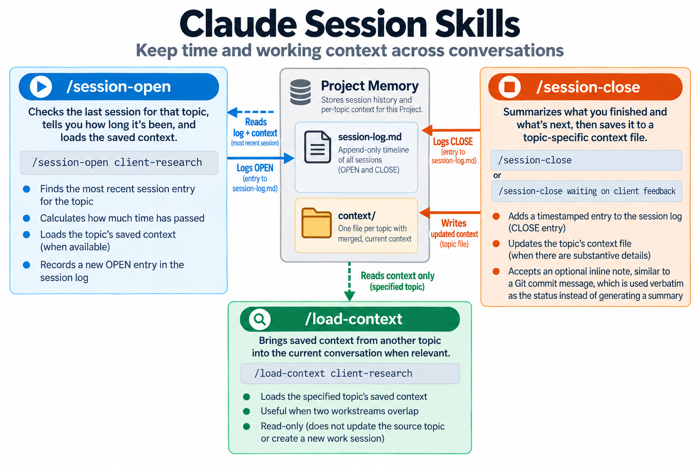

# Claude Session Skills

Three Claude skills for carrying time and working context across conversations.



## The problem

When you return to an older Claude chat, the conversation history is still there, but the passage of time isn't really part of the context. Coming back after 2 hours and coming back after 2 weeks aren't necessarily the same thing.

This becomes more noticeable when you're running several workstreams across different chats in the same Project. I wanted a simple way for Claude to know when I last worked on a topic, what I got done, what was still open, and what context might matter when I came back.

## The solution

Three custom Claude skills that work together inside a Project:

| Skill | What it does |
|---|---|
| `/session-open` | Reports how long since you last worked on a topic, loads your saved notes, and logs that you're back |
| `/session-close` | Summarizes what got done and what's next, then saves it to a per-topic context file |
| `/load-context` | Pulls any topic's saved notes into a different chat without copy-pasting anything |

A scheduled agent can also run at 6am daily to flag sessions left open overnight (setup instructions below).

## How it works

Start a work session:

```text
/session-open client-research

# → "It's been 3 days since you worked on this."
# → Loaded your client-research notes, including previous
#   decisions and open questions.

... do your work ...

/session-close

# → Logged - client-research, Wed Sep 23, 2:56 PM PT.
# → Did: Completed competitive research and updated requirements.
# → Next: Review findings and decide on implementation approach.
# → Context file updated.
```

In a different chat, you can then pull those notes in:

```text
/load-context client-research

# → Loaded your client-research notes:
#   previous decisions, findings, and open questions.
```

This lets each workstream maintain its own lightweight history without relying on one giant conversation as the source of truth.

### Project scope

These skills are **project-scoped**. Each person's session history and context files live inside their own Claude Project. Nothing is shared across accounts or Projects. The skills won't run outside a Project.

## Requirements

These skills are designed for use inside a Claude Project because they rely on project-scoped memory to maintain the session log and per-topic context files.

They also rely on access to the current time so session timestamps and elapsed-time calculations are based on the actual time rather than being inferred from the conversation.

Claude Skills require code execution to be enabled.

## Installation

### Claude

1. Zip each skill **folder** (e.g. `session-open.zip` containing `session-open/SKILL.md`). The folder name must match the skill's `name`.
2. In Claude, go to **Customize → Skills**.
3. Click the **+** button, then **Create skill**.
4. Select **Upload a skill**.
5. Upload the ZIP file for the skill you want to install.
6. Make sure the skill is enabled in your Skills list.

Repeat for `/session-open`, `/session-close`, and `/load-context`.

These skills are designed to run from conversations inside a Claude Project. They will stop rather than fall back to account-level memory when used outside a Project.

### Claude Code

Claude also supports Skills in Claude Code, but these three skills specifically depend on the project-scoped memory and time capabilities described above. Simply copying the skill folders into a standard Claude Code setup is not sufficient unless your environment provides those dependencies.

## File structure

Each skill writes to your Project's memory subtree:

```text
<project-memory>/
├── session-log.md          # append-only timeline of all OPEN/CLOSE entries
└── context/
    ├── client-research.md  # one file per topic, written by session-close
    ├── product-planning.md
    └── ...
```

There are two types of project memory:

### `session-log.md`

An append-only timeline of session activity.

`/session-open` and `/session-close` write standalone entries tagged by topic and timestamp. This gives the skills a history they can use to determine when you last worked on a specific topic.

### `context/<topic>.md`

A living context file for each topic.

`/session-close` reads the existing context file and merges the latest session into it rather than continually appending duplicate information.

`/session-open` can then load that context the next time you return to the topic.

`/load-context` provides read-only access to the same saved context from another chat.

## Why elapsed time matters

The session log isn't only there to record that a conversation happened.

`/session-open` uses the previous session timestamp to make the gap explicit:

```text
Last session: 3 hours ago
```

or:

```text
Last session: 3 weeks ago
```

Those situations may need very different amounts of context before continuing.

The skill doesn't try to decide what the passage of time means. It simply makes that information available alongside the saved working context.

## `/session-open`

Use:

```text
/session-open <topic>
```

The skill:

- finds the most recent session entry for that topic
- calculates how much time has passed
- loads the topic's saved context when available
- reports the elapsed gap and relevant context
- records a new `OPEN` entry in the session log

Topics are explicitly tagged rather than inferred only from whichever session happened most recently.

That matters when several conversations are active in the same Project.

## `/session-close`

Use:

```text
/session-close
```

The skill summarizes the current work session into information that will be useful when you return:

- what was completed
- what changed
- decisions that were made
- what remains open
- what should happen next

If you already know exactly what you want to preserve, you can also add a short inline note:

```text
/session-close waiting on client feedback
```

The inline note works a bit like a Git commit message. When provided, the skill uses it verbatim as the status instead of generating the usual `Did:` / `Next:` summary.

This is useful when the important thing to remember is simply where you left off and you don't need Claude to reconstruct the status for you.

It records the session in the log and updates the corresponding topic context file when the session contains substantive details worth preserving.

Context files are treated as living documents. Existing information is merged and updated rather than blindly appended after every session.

## `/load-context`

Use:

```text
/load-context <topic>
```

This is useful when two workstreams overlap.

For example, you might be working in `product-planning` but need decisions previously captured under `client-research`.

Instead of switching conversations or manually copying notes:

```text
/load-context client-research
```

loads the saved context into the current conversation.

`/load-context` is intentionally read-only. It does not update the source topic's context file or create a new work session for that topic.

## Optional: daily open-session check

You can set up a scheduled Claude task (Haiku model recommended for cost) that runs at 6am to report any sessions left open overnight.

The task prompt:

```text
Read the session log at <your-project-memory-path>/session-log.md.

Find topics whose most recent entry is an OPEN with no later CLOSE.

If none, send: "All sessions closed."

Otherwise list them with timestamps, most recent first.

End with: "Run /session-close in each chat to save them."
```

This isn't required for the three skills to work. It's a cleanup mechanism for sessions you forgot to close.

## Design decisions

### No auto-trigger

Claude's project instructions can nudge the model, but the skills must be invoked explicitly.

The workflow doesn't depend on Claude reliably deciding when a session has started or ended. The skills are designed to be resilient to missed invocations, and the optional scheduled check flags sessions that were left open so you can close them manually.

### Topic-tagged, never recency-only

Multiple chats can share the same session log.

Matching only by the most recent entry could surface context from the wrong workstream, so every session entry carries an explicit `Topic:` tag.

### Standalone entries

There is no fragile pairing dependency between `OPEN` and `CLOSE`.

If you forget to run `/session-close`, that session loses its `Did:` and `Next:` summary, but it doesn't corrupt the rest of the history.

The next session can still continue normally.

### Context files are merged, not appended

`/session-close` reads the existing topic context and rewrites it as one current document.

That prevents the context file from becoming an ever-growing sequence of repeated summaries and stale information.

### `/load-context` is read-only

Loading another topic's context shouldn't silently change that topic's state.

`/load-context` retrieves context without overwriting the source file or pretending a new session occurred there.

## Privacy

Persistent context should be selective.

`/session-close` will never save:

- salary, compensation, or other private financial figures
- credentials
- government ID numbers
- account numbers
- health details

Those details are omitted from the context file entirely rather than replaced with placeholders.

If you modify these skills for your own workflow, review the persistence rules in `session-close/SKILL.md` and adjust them for the information you work with.

## Status

I'm actively using and experimenting with these skills and expect the collection to evolve as I find other session and context-management problems worth solving.

If you modify them or find an edge case, feel free to open an issue or submit a pull request.

## Disclaimer

This is an independent project and is not affiliated with or endorsed by Anthropic.

## License

MIT — see [LICENSE](LICENSE).
